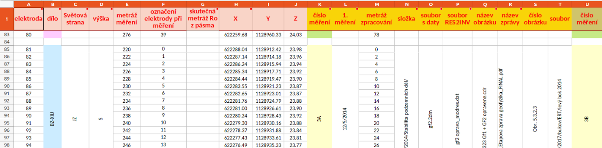
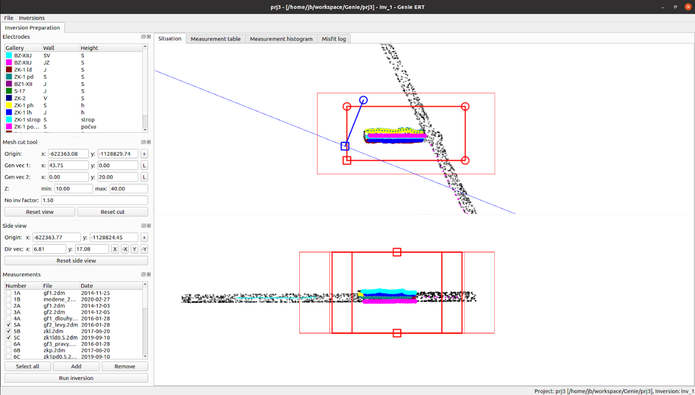
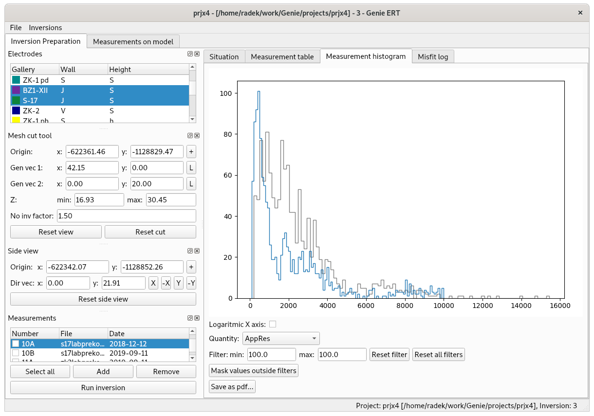
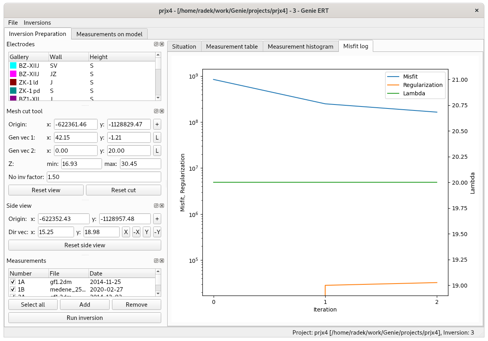
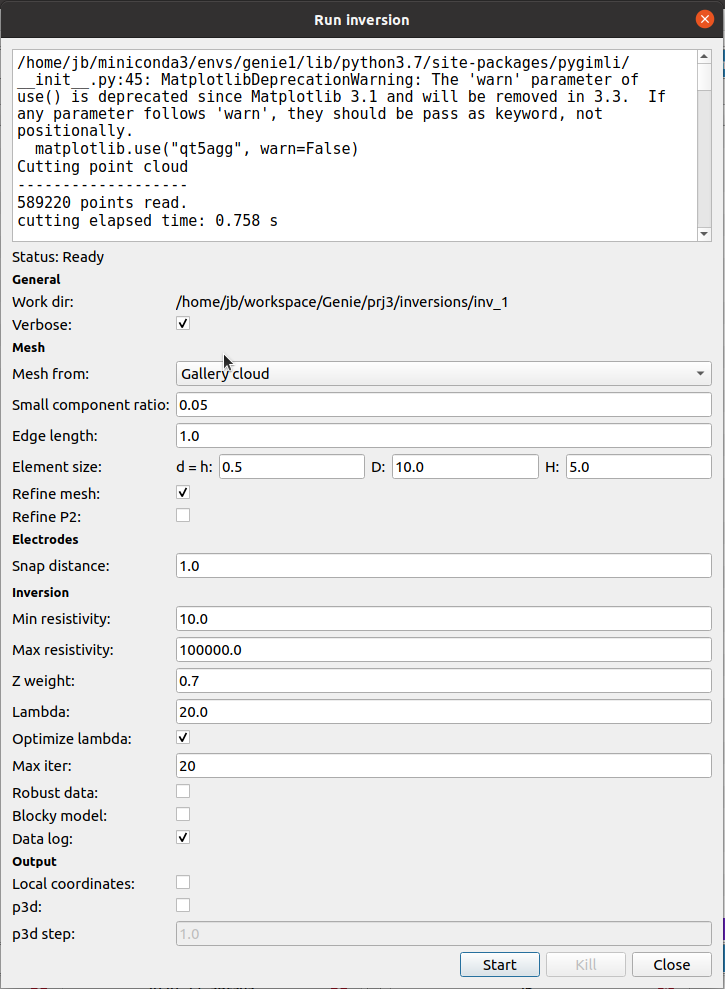
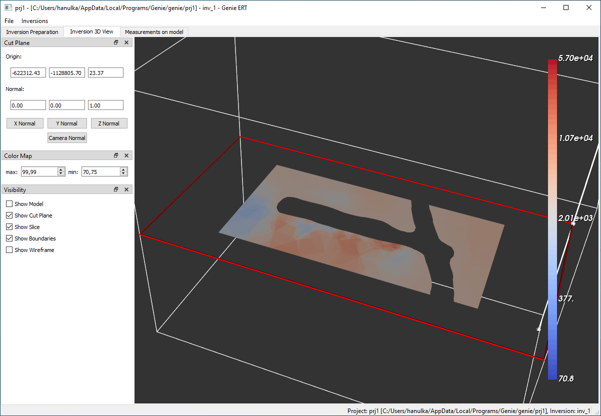
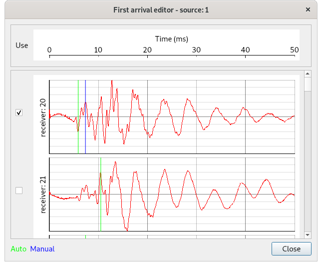

<link rel="stylesheet" href="path/to/css/air.css">

# Genie reference manual

## 1 Installation
### Windows
Installation packages are available at <https://geomop.nti.tul.cz/genie/packages/>.
Standard graphical installer is available for Windows 10. To run the installation execute file
genie_1.0.0_x86_64.exe and go through installation wizard. Individual tools are executable by
their shortcuts or by batch files. Batch files are in default installation located in directory:
c:\\Users\\UserName\\AppData\\Local\\Programs\\Genie\\bin\\.

### Linux
#### install pygimli
``` bash
conda create -n pg -c gimli -c conda-forge pygimli=1.2.1
``` 
For detailed description go to <https://www.pygimli.org/installation.html>.

#### clone project repository
``` bash
git clone https://github.com/GeoMop/Genie.git
```

#### install python packages
``` bash
pip install -r requirements.txt
```

## 2 Summary
The collection of the Genie tools (GeniERT and GenieST) is suited to performing 3D inversion of electrical resistivity and seismic measurements, respectively.
Both tools are specially crafted to simplify 3D inversion in mining galleries with complex geometry. The library [MeshLab](https://www.meshlab.net) is used to process laser-scan data into the geometry of the galleries, then the [GMSH](https://gmsh.info/doc/texinfo/gmsh.html) meshing library is used for the preparation of the computational mesh. Finally, the [PyGIMLI](https://www.pygimli.org/) library is used to run actual ERT and ST inversions. Moreover, we provide tools for the organization of the data from measurements and simple visualization of the inversion results.


## 3 Genie ERT
GenieERT is software for [electrical resistivity tomography](https://en.wikipedia.org/wiki/Electrical_resistivity_tomography) 
in particular on exterior domains like surrounding rock of the mine galleries.

### 3.1 Forward model
From many resistance measurements (usually) on the surface of a rock block, ERT constructs an approximation of the specific resistivity 
of the rock as a function of space and thus allows to infer the geological structure of the rock. The resistivity of the rock is mainly
affected by the amount of water in the rock and its salinity.
Let us denote $\Omega_b$ the domain of ​​the investigated block, to approximate the influence of the outer rock  we consider 
a larger computational domain $\Omega \supset \Omega_b$ with a boundary $\partial\Omega$. 
This boundary includes both the surface of the gallery $\Gamma_n$ as well as the outer boundary $\Gamma_d$ sufficiently far from $\Omega_b$.
The basic equation is conservation of the electric charge:

$$ div J(x) = f(x) $$


where $J$ is the current density $[Am^{-2}]$ and $f$ is the density of the current sources $[Am^{-3}]$. 
The current density is given by Ohm's law:

$$ J = \sigma E$

where $\sigma$ is the electrical conductivity $[\Omega^{-1}m^{-1}]$, which is the inverse of the resistivity $\rho$ $[\Omega m]$. The intensity of the electric field 
$E$ $[Vm^{-1}]$ is given by the electric potential $u$ $[V]$:

$$ E = -\nabla u$$

After substituting to the previous equations, we obtain a partial differential equation for the potential $u$:

$$ -div\left( \frac{1}{\rho} \nabla u \right) = f \quad \mbox{in} \Omega $$

provided the resistivity field $\rho$ and the prescribed density of current sources $f$.
We consider a homogeneous Neumann boundary condition (zero current density) on the surface of the gallery $\Gamma_n$
and a homogeneous Dirichlet condition (zero potential) on the outer boundary $$\Gamma_d$$. 
The source density usually includes two point sources with opposite signs corresponding to the current electrodes:

$$ f(x) = I\left(\delta(x-x_B)- \delta(x-x_A)\right).$$

Since the potential is a linear function of the current, it is sufficient to consider the unit current $I=1$ from $A$ to $B$ in the calculation.


In the case of an infinite domain, constant resistivity, and point source in $x_0$:

$$ f(x) = I\delta(x-x_0)$$

The governing equation in 3d space admits the analytical solution:

$$ u(x) = \frac{\rho_a I}{4 \pi |r|}, \quad r=x-x_0.$$ 

Theoretically, it would be possible to measure the current for the prescribed voltage between two electrodes,
but to eliminate very variable contact resistance between electrodes and rock, a four-point scheme is usually chosen, 
where a constant current $I$ is maintained between electrodes with and positions $x_A$ and $x_B$ and the potential difference $U$
is measured between the electrodes $x_C$ and $x_D$. 
In equidistant line measurements on the earth's surface, the positions of the electrodes are approximately given by their order,
but when measuring on the surface of the mine gallery, complete and sufficiently accurate information 
about the position of the electrodes in space is crucial for 3d inversion of the resistivity. 
The ratio $U/I$ is a sufficient input to the inversion since $U$ is a linear function of $I$.
However, to narrow the magnitude of the inputs and better assess measurement deviations, 
the so-called apparent resistivity is usually considered. That is the resistivity of an imaginary infinite medium with constant resistivity. 
To this end we use the analytical solution for individual electrodes to obtain the potential difference:


$$ U(C,D) = u_{AB}(D) - u_{AB}(C) = \frac{\rho_a I}{4\pi} \left( \frac{1}{r_DB} - \frac{1}{r_DA} - \frac{1}{r_CB} + \frac{1}{r_CA} \right) $$ 

From here, the apparent resistivity $\rho_a$ can be determined for known positions of the electrodes.
Therefore the input of the inversion consists of:

- Computation domain $\Omega$. A computational mesh is also required for numerical solution.
- Vector of electrode positions $x_i$.
- Data of individual measurements $(i_A, i_B, i_C, i_D, \rho_a, s)$, 
  including the indices of current and potential electrodes, the apparent resistivity and its standard deviation.

The forward model is calculated for each measured pair of current electrodes and while all pairs of potential electrodes
are evaluated from the resulting approximation of the potential.


### 3.2 Computational geometry and mesh

Genie ERT software aims mainly on underground applications of ERT. 
One of the goals is to characterize the excavation damage zone (EDZ) close to the mine gallery walls.
Manual modeling of such complex geometry is very laborious and could introduce another source of error for the sake of simplicity.
Genie ERT and ST significantly simplify this process by automatic creation of the computational geometry and mesh
from laser scanning.

Laser scanning is a rapidly evolving and cost-effective technology for converting real geometries 
into a virtual model. In our case, the result of scanning and subsequent processing is a cloud 
of points on the walls of the mine in the form of a text file where on each line there are three
XYZ coordinates of one point. The local coordinate system is used in the scan, however, 
when processing the data, the coordinates are converted to the regional coordinate system. 
For use in the Czech Republic, we assume the JTSK system for XY coordinates and altitude for the Z coordinate. 
A different coordinate system can be used, but the same system must then be used for the coordinates of electrodes or geophones.

The input point cloud can be extremely detailed with a resolution of up to 1mm and file size in tens of GB. 
Working with such a large file is time-consuming, so the import of the point cloud includes a filter to reduce
the resolution, other operations then take place over the reduced point cloud.
The geometry is created before the actual inversion calculation according to the specified block computational domain $\Omega$.
The procedure for creating a computational mesh is as follows:

The point cloud is cropped to a slightly expanded computational domain. Then the points (on the mine wall) are used to approximation
of the surface by a triangular mesh. The MeshLab is used for this step based on the Marching cubes algorithm. By changing 
the size of the cubes it is possible to influence the resolution of the approximation. Moderate resolution is suitable to capture the significant
shape of the gallery while eliminating unwanted artifacts in the point cloud.
Furthermore, the intersection of the surface mesh with the outer boundary is determined and the computational domain is described using the boundary
representation in the BREP format. This process includes:
    1. Cutting out the gallery from the computational block.
    2. Trimming the gallery surface with the boundary block.
    3. Joining these two objects to form the closed boundary of the computational domain without holes.
The boundary representation is then input to the GMSH meshing tool, which is called via its Python API.
A scalar field is constructed to control the step of the mesh elements, 
which depends on the distance from the gallery walls. It is thus possible to prescribe a fine step 
near the walls and gradual coarsening towards the outer boundary.

The overall procedure is relatively robust to various artifacts in the input data if the dimensions 
of the artifacts are smaller than the required mesh resolution, which should be adapted to resolve individual electrodes properly.
However, if the size of the artifacts (e.g. fences, ventilation, cables) is comparable to the target resolution the point cloud has to be 
manually cleaned with an appropriate tool (e.g. LabMesh).

There are two other options how to prepare the computational mesh. The first is a block-shaped domain with an uneven surface given 
by the point cloud/grid for classical surface applications of ERT. The second option is to import the mesh prepared manually 
using GMSH (https://gmsh.info/).

### 3.3 Organization of input data
Genie ERT assumes measurement data in the form of text files with format produced by the apparatus Ares II from company GF Instruments.
The format (see input files in `tests` folder) starts with a header containing the measurement metadata: time and date, 
location, operator, measuring method, arrangement of electrodes. After the header the data of individual measurements
follows, every line contains: indices of two current and two potential electrodes, the voltage on current 
electrodes $U_{out}$ $[V]$, current on current electrodes $I$ $[A]$, voltage on potential electrodes $U$ $[mV]$, 
apparent resistivity $R$ $[\ Ohm]$, and standard deviation $S$ of the measurement $[%]$.
The electrode indices, the $U / I$ ratio and the standard deviation are used for the calculation. 
The apparent resistivity $R$ is calculated by the apparatus assuming the linear placement of the electrodes
and is therefore not used. We rather use apparent resistivity $R_{in}$ calculated from true electrode positions (see the next paragraph).
Both resistivities, as well as the model results, can be compared in the `Measurement table` panel (see below).
Some measurements contain negative U-values. Although theoretically possible these values cause problems
in the inversion, so they are masked by default.

As the raw measurement data do not contain the actual electrode positions, it was necessary to create a format 
for additional metadata containing: 3d electrode coordinates, measurement overview with links to measurement 
result files, assignment of electrodes in individual measurements to their coordinates. From the information
point of view, it is appropriate to manage separately a table with unique electrode indices and their coordinates
and a table with an overview of measurements assigning electrodes in one measurement to their global indices. 
This concept was also implemented first but did not meet the needs of the project partner, so the format
of one table was finally chosen. A section of the input table in XLS Excel format is shown in 
*Fig. 1.: Input table with measurement metadata*. 
Columns A-J contain electrode arrangement data, columns K-T contain 
data from the first measurement in this arrangement, other columns contain repeated measurements.


*Obr. 1 Input table view with measurement metadata. Columns A-J contain electrode arrangement data, 
columns K-T contain data from the first measurement in this arrangement, other columns contain repeated measurements.*

The Genie ERT program reads the electrode arrangement data from the columns A-J, the measurement code from column K, 
the date from column L and the file with measured data from column O. Corresponding columns of the repeated measurements are used.
The folder column N is ignored, the measurement data file has to be placed in the subdirectory named by the measurement code 
relative to the table file.
From columns A-J, only the coordinates (columns H-J) and the electrode index within measurement (column F) 
are actually used for the calculation, the other columns are only used for reference.

Import function of the metadata table also deals with possible inconsistencies, in particular, it performs the following steps:
- load the table from the Excel format
- try to recognize the structure of repeated measurements on the same set of electrodes
- deduplicate information about electrodes used in multiple measurements
- detect possible errors in the electrode indices within measurements and their coordinates
- check the consistency of metadata and measurement data

Having the metadata table imported, the referenced measurement files are loaded and inadmissible values ​​
are excluded (masked) (negative potential differences, large deviations, ..). 
The user can perform custom masking using the `Measurement table` panel.

The Genie ERT allows performing more inversions with different settings for the single set of measurements forming a single *project*.
A single project has complete data in the directory of the same name,
contains the point cloud, the background map, the file with measurement metadata, and subdirectories with the raw measurement data. 


### 3.4 User Interface
The user interface consists of the main menu, configuration panels on the left and the main graphic window with several tabs,
see Fig. 2. We will describe these components in more detail below.



*Fig. 2 Genie ERT application overview. Standard menu, configuration panels on the left, main graphic window with the situation on the right.*

#### 3.4.1. Main menu
The main menu contains the item `File` for project organization and the item `Inversions` to select 
the current inversion and organize the inversion list. Further, we just describe import dialogs accessible through the `File` menu.

`Import excel file…` : import metadata file. The dialog has an option to transform the electrode coordinates into a conventional
positive quadrant of the JTSK system during reading.

`Import point cloud…` : import point cloud. Optionaly the origin of the local coordinate system of the project can be prescribed in order to reduce 
numerical error in the calculations. It is also possible to set the merging of nearby points 
with a given tolerance to reduce the amount of data. The `Read` button will load the selected file with the specified 
transformation and filter. The `Save results` button allows you to save the result of the read step for reuse, the `Import` button will load the result into the project.

`Import mesh gallery…` : load computational mesh. To use it, you need to change the `Mesh from` item in the inversion dialog.

`Import maps …` : common raster (png, jpg, tiff, ...) and vector (svg, pdf, eps, ...) formats are supported for importing the background map for the plane view of the galleries. 
To display the map correctly, you need to georeference it by moving the red and blue crosses to the points with known coordinates and entering these coordinates to appropriate text fields.

####  3.4.2 Graphical panels
In the left part of the application, there are panels for: electrode selection, computation domain selection, and 
active measurements. The configuration changes in the panels are linked to the visualization of the electrodes and the computation domain 
in the main graphics window on the right. There are four configuration panels:

`Electrodes` : List of color-coded electrode groups. Measurements that contain electrodes from the selected groups are selected for the selected groups.

`Mesh cut tool` : Selection of the computation domain block. It can also be controlled graphically using the red tool in the graphic window.
The inversion domain is strongly marked, the larger computational domain of ​​the forward model is weakly marked. 
Their size ratio can be entered via the `inv factor` text field.

`Side view` : Position of the side view (lower part of the graphic window). Grephicaly can be controled by the blue tool in the plane view (upper part). 
All points are displayed with high transparency, points close to the blue line are highlighted.

`Measurements` : Selection of the measurements used for inversion. The combined data of the selected measurements can be further 
filtered using the `Measurement table` and `Measurement histogram` tabs.
The `Run inversion` button opens the dialog for starting the inversion described below.

####  3.4.3 Main graphics window
The main graphics window contains tabs: `Situation`,` Measurement table`, `Measurement histogram`,` Misfit log`.
Crucial is the situation tab used to select the computational domain and to display the data used for the inversion. 
It consists of the plan view (top) and the side view (bottom). These views contain following graphical elements:

- The background map of galleries is bound to other elements using the georeferencing specified in its import dialog.
- The point cloud is indicated by gray dots. Only a subset of all points is used for display.
- Computational mesh, displayed instead of the point cloud if an external mesh is imported.
- The positions of the electrodes are marked with different colors according to their assignment to the designation of the galleries. 
  For the currently selected measurements, the used electrodes are highlighted with a larger dot size.
- The position and orientation of the side view can be adjusted by the blue control.
- The computational domain is selected using the red control. The computational domain has the prism shape with a parallelogram at the base.

The `Measurement table` and `Measurement histogram` (see Fig. 3) tabs allow to display and filter measurement data passed into the inversion. 
The data can be masked by selecting individual rows of the table or by using a filter when displaying the histogram. 
In addition, the quantities predicted by the model are available after an inversion is completed, especially the apparent resistivity 
of individual measurements predicted by the model (quantity `AppResModel`) can be compared to the measured values.


*Fig. 3 Histogram panel for the selected quantity. The previously selected quantity with the same unit is displayed in gray for comparison.*

The `Misfit log` tab contains a graph of the development of key indicators during the iterative solution of the last inverse problem, see Fig. 4.
Iterations are on the horizontal axis, the difference between the measurement and the model (Misfit), the regularization penalty (Regularization),
and the value of the regularization coefficient (Lambda) are on the vertical axis.



*Fig. 4 Misfit log panel, displays progress during the solution of the last inverse problem.*

#### 3.4.4 Run inversion dialog
The inversion calculation includes both the automatic preparation of the computational mesh as well as the iterative 
optimization algorithm itself. The main input data of the inversion: selected measurements, the outer boundary of the computational domain,
and the point cloud are entered graphically. Invalid and masked measurements are automatically removed from the inversion input,
as well as the measurements with electrodes out of the inversion domain.

The `Run inversion` dialog (Fig. 5) is used to set other parameters of the used algorithms (on the left), the standard output of the current inversion is on the right.
The available parameters are divided into five groups:
`General` : displays the working directory of the inversion (contains the mesh and results), the verbosity of the standard output can be selected

`Mesh` : parameters for the meshing step:

- `Mesh from` : how the mesh geometry is formed, the choice between: interior boundary given by the point cloud (Gallery cloud), top boundary given by the point cloud (Surface cloud), and
   imported mesh (Gallery mesh)
- `Small component ratio` : the relative resolution of the initial boundary mesh with respect to the size of the domain. Smaller values lead to better resolution of the point cloud including possible artifacts.
- `Edge length` : mesh element size on the internal boundary given by the point cloud
- `Element size` : mesh adaptivity with respect to electrodes (both on the boundary as in the wells), element size `h` is used up to the distance `d` from the electrodes, and element size `H` is used for distance `D` and greater. Linear transition is applied in between.
- `Refine mesh` : allow adaptive refinement of the mesh by the forward solver
- `Refine P2` : allow the use of second-order finite elements (experimental)


`Electrodes` : electrodes are automatically attracted to the surface of the computational domain to a specified distance. 
By suitable choice, the attraction of the electrodes in the wells can be switched off.

`Inversion` : various parameters of the optimization algorithm
- `min resistivity`, `max resistivity` : hard bounds for the resulting resistivity field enforced by suitable logarithmic transform
- `Z weight` : Regularization anisotropy. For the values less than 1, the regularization in the vertical direction (Z-axis) is diminished, which can lead to better 
resolution of possible geological layers. 
- `Lambda`, `Optimize lambda` : Coefficient of the regularization term. Higher values lead to a smoother result, lower values to overfitting. The default value is 20. Automatic optimization 
  tries to optimize the regularization parameter using the L-curve approach.
- `Max iter` : Upper bound for the number of iterations of the optimization (Levenberg-Marquardt) algorithm.
- `Robust data` : Use L1 norm for the misfit. Can be beneficial in the case of significant outliers in the data, 
  but not used by default as it may cause deteriorated resolution. Default is usage of the L2 norm, assuming Gaussian error of the measurement.
- `Blockly model` : Use L1 norm for the regularization term. Discontinuous resistivity field.
- `Data log` : Use logarithmic transformation of the measurement/model data before evaluation the misfit.
<!---
**Constraint type** (? is it supported in PyGimli) 0,1,2 (1 is default), order of derivative used in the regularization term. 
TBD see [PyGimli tutorial](https://www.pygimli.org/_tutorials_auto/3_inversion/plot_6-geostatConstraints.html)
-->
Based on [parameters of the inversion](https://www.pygimli.org/pygimliapi/_generated/pygimli.manager.html) of the PyGimply library and 
on the related SW Bert [Chapter 2.2](http://www.resistivity.net/download/bert-tutorial.pdf).


`Output` : inversion results are output in VTK format by default. Alternatively, you can turn on output on a regular grid in P3D format.

</br>
*Fig. 5 Dialog for setup parameters and run the inversion.*

#### 3.4.5 Visualization of results
After the inversion calculation, the resulting resistivity field is output to the inversion working directory in VTK format. 
The basic visualization of the results can be performed directly in the application 
in the `Inversion 3D View` tab, see Fig. 6.


*Fig. 6 Visualization of the inversion result: resistivity field on selected sectional view.*

## 4 Seismic tomography
Genie ST has an interface very similar to Genie ERT, significant differences are only: the forward model, organization of the measurements, 
and identification of the first arrival times. 

### 4.1 Forward model
We consider following measurement procedure:
- geophones are placed on the wall of the gallery or in the borehole,
  connected to the measuring apparatus (limited to about 16 concurrent inputs). 
- Subsequently, a mechanical shock is induced at selected positions by tapping the wall with a geological hammer.
- The strike is registered in the apparatus to start recording the signal from the geophones.

Theoretically, the propagation of the material deformations is described by the Navier-Cauchy equation with a potentially 
inhomogeneous and anisotropic elasticity tensor. Its numerical solution would theoretically allow the use of the complete recorded signal
for the inversion, but the solution is sensitive to the initial condition, which is burdened with great uncertainty in the case of the impact stimulation.
This approach is thus more suitable for periodic input signals, such as ultrasonic measurements.

Therefore only the so-called *first arrival* time is used for every recorded sample. To predict this quantity, it is possible 
to use Fermat's principle, saying that the excitation in the sense of a beam propagates from the source to the receiver 
along the path with the shortest time. The ray-tracing method (Moser (1991), Klimeš and Kvasnička (1994)) using the graph 
theory algorithms, specifically modified Dijkstra's algorithm, is based on this principle. 

The input of the forward model is the *slowness* field, i.e. the reciprocal values ​​of the wave velocities 
on the elements.  The output is the vector predicted arrival times for the individual measurements. Additional auxiliary nodes are
added to the sides of the mesh elements $K \in T$. Let us denote $N$ the extended set of mesh nodes, and $N_K$ the set of nodes 
on the boundary of an element $K$. The graph is constructed on the vertices $N$ and a complete subgraph on the vertices $N_K$ is added for every element. 
Every edge $(u,v)$ for the nodes on an element $K$ is labeled by the time distance:

$$ w(u,v) = z_K |u - v|

where $z_K$ is the slowness on the element $K$. 

Dijkstra's algorithm determines the shortest path from one source vertex (strike position) to all vertices of the graph. 
Thus, one run of the algorithm finds the arrival times for all measurements with a common source. Dijkstra's algorithm with 
appropriate modifications have approximately linear complexity, so the total time of the forward model is proportional to $knm$, 
where $n$ is the number of nodes,
$m$ is the average number of edges from one node, and $k$ is the number of sources.
The resulting arrival time depends continuously, but not smoothly, on the slowness vector on the elements. 
This can cause some problems for gradient methods. However, if derive-penalized regularization is used, the changes 
in the slow field are small and there are no problems with the convergence of the solver.

###  4.2 Organization of input data
Recordings of the geophone signals for individual strikes are stored in SEG2 format. The times of the first arrivals (arrival of the P-wave) 
must be identified from the raw data. As for Genie ERT, the position of 
all geophones and strikes have to be specified. 

Metadata for individual measurements consists of two Excel tables in a single XLSX file. The table on the first sheet contains 
unique indexes of positions in 3D space for both the geophones and the strikes. The table contains columns: position number,
the indicative linear position on the gallery (borehole), XYZ coordinates. The table on the second sheet assigns metadata for every SEG2 file.
The table contains columns: file name, source position number, position number of the first geophone, position number of the last geophone, first valid channel.
Here, it is assumed that the scanned geophones form a continuous sequence in the first table.

To identify first arrival times, Genie ST contains functionality for automatic or manual identification of the first arrival times.
Alternatively, you can also import a table of already identified first arrivals. The XLSX table must contain the coordinates
of the geophones in the first three columns and the coordinates of the strikes in the first three rows. The coordinates are
retrieved in the main metadata file, and for valid source-geophone pairs, the first arrival time is imported from the cell
on the appropriate column (source) and the appropriate row (geophone). Imported times are used as if they were identified manually.

### 4.3 User interface
The user interface is very similar to GenieERT. The main differences are the input of the inversion domain without the extended computational domain
and the tool for identifying the first arrivals from the geophone signals. The editor can be opened for individual measurements
by double-clicking in the `Measurements` panel.

The editor of the first arrivals (see Fig. 7) displays the synchronized waveforms on the individual geophones. 
The first arrival times are automatically identified from the waveforms. The automatically identified value (green) can be overriden manually (blue).
GenieST does not include a table and histogram for the input data overview.

</br>
*Fig. 7 First arrival editor. Displays signals from geophones and allows automatic or manual identification of the time of the first arrival*


<!--
## Mesh cut tool
Mesh cut tool sets area of interest, either in text edits or using red shape on right side,
position of shape in 3D space must be that, gallery cut was on shape faces, not on edges.
Button "+" move origin point to center of area defined by points cloud, electrode positions and map.
Button "L" sets gen vector perpendicular to other vector.

## Analyse measurement
Analyse measurement dialog is activated by double clicking on measurement in left bottom part, it shows data from measurements files.
Columns ca, cb, pa, pb, I, V, std, AppRes are from measurement files.
**AppResGimli** is apparent resistivity computed from input values using Gimli geometric factor function,
which use full 3d space not half space and use elecrode positions from input xls file, that apparent resistivity values are different.
Lines not suitable for computation are marked with red color, this lines are not use in computation, they do not need to be deleted from the files.

## Measurement table
Table shows all measurements from selected measurements from left bottom panel.
Table may be sorted by individual columns by clicking on column header.
Individual measurements may be masked by clicking on checkbox. This measurement will not be used in inversion.
For mask multiple measurements select them and click on mask in context menu.

## Measurement histogram
Shows histograms of quantities from Measurement table. It is possible to apply filter on relevant quantity.
This filter is also applied on relevant quantity in Measurement table.

## Map file
It is posible to import a map. From file menu choose "Import map...".
After image file is selected, dialog for map calibration is appeared.
Move blue and red cross to two points with known positions and type this positions to edit box below, then click on import.

## Import gallery mesh
Gallery mesh generated from point cloud can be replaced by own mesh.
Mesh must be in .msh format.
From file menu choose "Import gallery mesh...".
Mesh is shown in blue color.
In "Run inversion" dialog set parameter "meshFrom" to "Gallery mesh".

## Surface from point cloud
Inversion mesh can be defined by point cloud on some surface. Other mesh faces are defined by Mesh cut tool area of interest.
Area of interest must be positioned inside region defined by point cloud.
From file menu choose "Import point cloud...".
In "Run inversion" dialog set parameter "meshFrom" to "Surface cloud".

## Measurements on model panel
After successful inversion is shown tab "Measurements on model" in which are displayed apparent resistivity on model obtained by inversion.
Columns meas_number, ca, cb, pa, pb, I, V, AppRes, std are from measurement files.
**AppResGimli** is apparent resistivity computed from input values.
**AppResModel** is apparent resistivity on model.

## Tips
- cut of point cloud is time consuming operation, if we want to work with smaller area,
  after first inversion computation is possible to import to project file inversions/inversion_name/point_cloud_cut.xyz,
  which contains cut point cloud
- in installation is included software Gmsh, which can be used for showing and editing of meshes

## Description of files in inversion directory
- inv.conf - configuration of inversion
- point_cloud_cut.xyz - cut point cloud
- gallery_mesh.ply, gallery_mesh.msh - gallery mesh
- inv_mesh.msh - mesh for own inversion
- input.dat - file with electrode positions and list of individual measurements
- input_snapped.dat - like previous, but electrodes are snapped to gallery mesh
- resistivity.vtk - result of inversion .vtk file
- resistivity.vector - resistivity vector on individual elements
- resistivity.p3d - result in p3d format
- resistivity.q - second file of p3d format

## Known issues
- some measurements have to small current, it may cause inaccuracy in computation, currently this is not solved in any way

## Genie ST
Application Genie ST is similar to Genie RT. There is a "First arrival editor" dialog instead of "Analyse measurement",
in which are displayed signal waveforms from individual measurement files.
It is possible to set actual first arrivals by blue vertical lines.
Some receivers can be disabled by unchecking checkboxs in left column.

-->
